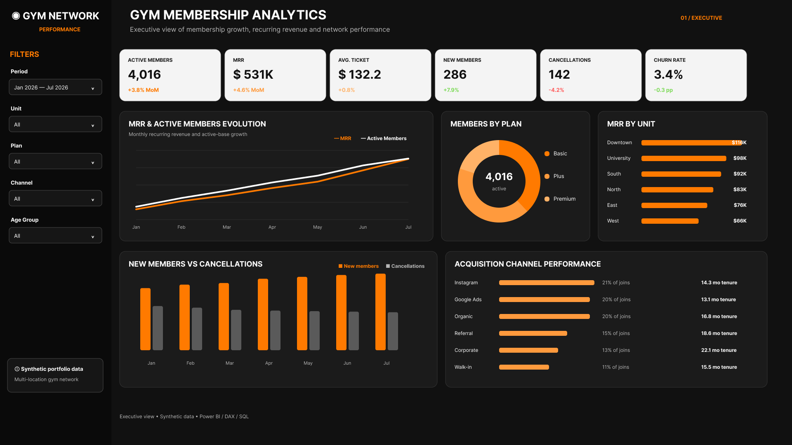
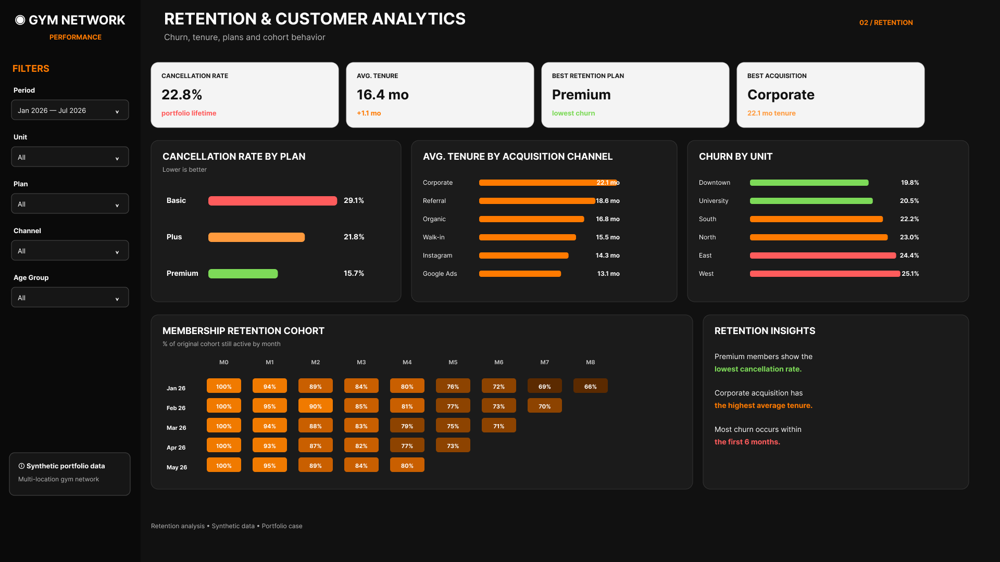
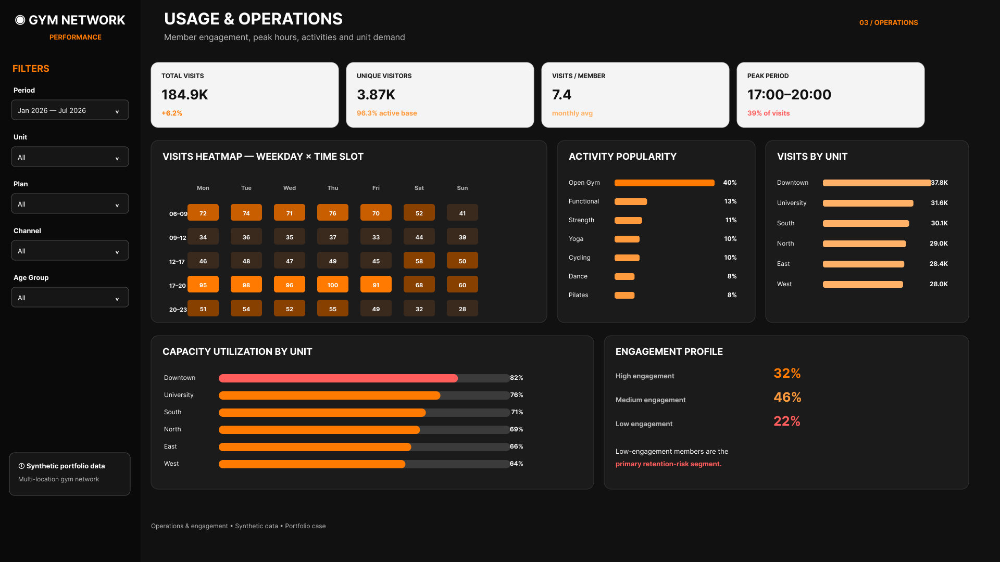

# 🏋️ Gym Membership Analytics

> **End-to-end Business Intelligence project analyzing membership growth, recurring revenue, churn, retention and customer engagement across a multi-location fitness network.**

## 🎯 Overview

This project analyzes the performance of a fictional **multi-location gym network**, combining financial, customer and operational perspectives in an interactive Power BI solution.

The analysis follows the customer lifecycle:

**Acquisition → Membership → Engagement → Retention → Revenue**

The objective is to understand not only how the membership base grows, but also **what drives retention, recurring revenue and gym utilization**.

All records, locations, customers and financial values are fully synthetic and were created specifically for public portfolio use.

---

## 📊 Dashboard

The Power BI solution is divided into three analytical views.

### 1️⃣ Executive Overview

Provides a high-level view of the network's financial and membership performance.



**Key analyses:**
- Active members
- Monthly Recurring Revenue (MRR)
- Average ticket
- New memberships
- Cancellations
- Churn rate
- MRR evolution
- Membership growth
- Revenue by unit
- Acquisition channel performance

---

### 2️⃣ Retention & Customer Analytics

Focuses on understanding **member retention, churn behavior and customer lifetime patterns**.



**Key analyses:**
- Cancellation rate
- Average membership tenure
- Churn by membership plan
- Churn by gym unit
- Average tenure by acquisition channel
- Cohort retention analysis
- Identification of higher-retention customer segments

---

### 3️⃣ Usage & Operations

Analyzes how members interact with the gym network and how demand is distributed across locations and time periods.



**Key analyses:**
- Total visits
- Unique visitors
- Visits per member
- Peak hours
- Visits by gym unit
- Activity popularity
- Weekday × time-slot heatmap
- Capacity utilization
- Member engagement profile

---

## 💼 Business Questions

The dashboard was designed to answer questions such as:

- Is the active member base growing?
- How is recurring revenue evolving?
- Which gym units generate the most revenue?
- Which membership plans have the strongest retention?
- Where is churn highest?
- Which acquisition channels bring longer-lasting members?
- How long does the average member remain subscribed?
- When does the network experience peak demand?
- Which activities generate the most engagement?
- Which member segments present higher retention risk?

---

## 📌 Key KPIs

| KPI | Description |
|---|---|
| **Active Members** | Current active membership base |
| **MRR** | Monthly recurring revenue generated by active memberships |
| **Average Ticket** | Average monthly revenue per member |
| **New Members** | New memberships acquired during the period |
| **Cancellations** | Membership cancellations |
| **Churn Rate** | Percentage of members leaving the network |
| **Average Tenure** | Average membership duration |
| **Delinquency Rate** | Share of members with unpaid monthly fees |
| **Total Visits** | Total recorded gym visits |
| **Visits per Member** | Average engagement frequency |
| **Capacity Utilization** | Demand relative to available unit capacity |

---

## 🛠️ Tech Stack

| Technology | Application |
|---|---|
| **Power BI** | Dashboard development and interactive analysis |
| **DAX** | Revenue, churn, retention and engagement KPIs |
| **Power Query** | Data preparation and transformation |
| **SQL** | Customer, revenue and operational analysis |
| **Data Modeling** | Multi-table analytical model |

---

## 🗂️ Data Model

The analytical model combines four synthetic datasets:

### Members

Customer-level information including:

- Membership plan
- Gym unit
- Acquisition channel
- Join date
- Cancellation date
- Membership status
- Customer tenure

### Monthly Membership

Monthly snapshots used to analyze:

- Active member base
- Monthly recurring revenue
- Average ticket
- Delinquency

### Visits

Member-level gym usage containing:

- Visit date
- Gym unit
- Activity
- Time slot

### Unit Capacity

Operational capacity information used to compare **member demand with available capacity** across units and time periods.

---

## 🔎 SQL Analysis

The SQL layer includes queries for:

- Member growth
- MRR by gym unit
- Churn by membership plan
- Member engagement
- Peak-hour analysis
- Acquisition channel and retention performance

See [`sql/`](sql/).

---

## 🧮 DAX Measures

The Power BI model includes measures for:

- Active members
- MRR
- Average ticket
- New members
- Cancellations
- Churn rate
- Delinquency rate
- Average tenure
- Total visits
- Unique visitors
- Visits per member
- Capacity utilization

See [`powerbi/measures.dax`](powerbi/measures.dax).

---

## 📁 Project Structure

```text
gym-membership-analytics/
│
├── data/
│   ├── members.csv
│   ├── monthly_membership.csv
│   ├── visits.csv
│   └── unit_capacity.csv
│
├── docs/
│   ├── 01_executive_overview.png
│   ├── 02_retention_customer_analytics.png
│   ├── 03_usage_operations.png
│   └── data_dictionary.md
│
├── powerbi/
│   ├── measures.dax
│   └── BUILD_GUIDE.md
│
├── sql/
│   ├── 01_member_growth.sql
│   ├── 02_mrr_by_unit.sql
│   ├── 03_churn_by_plan.sql
│   ├── 04_engagement.sql
│   ├── 05_peak_hours.sql
│   └── 06_acquisition_retention.sql
│
└── README.md
```

---

## 🔐 Data Privacy

This repository contains **no proprietary company or customer data**.

All member records, gym locations, financial values, customer behavior and operational information were generated synthetically for portfolio purposes.

The project was designed to reproduce realistic Business Intelligence scenarios without exposing confidential information.

---

## 💡 Key Business Insights

The dashboard enables identification of patterns such as:

- Membership plans with stronger or weaker retention
- Acquisition channels associated with longer customer tenure
- Gym units with higher recurring revenue and utilization
- Peak periods of operational demand
- Member segments with lower engagement and potentially higher retention risk
- Differences between membership growth and cancellation behavior

These insights can support decisions related to **customer retention, marketing investment, membership strategy and gym capacity planning**.

---

## 📌 What This Project Demonstrates

This project demonstrates an end-to-end Business Intelligence workflow:

**Business Problem → Data Modeling → SQL → DAX → Power BI → Business Insights**

It showcases practical experience with:

`Power BI` · `DAX` · `SQL` · `Power Query` · `Data Modeling` · `Churn Analysis` · `Retention Analysis` · `Cohort Analysis` · `Customer Analytics` · `Revenue Analytics` · `Business Intelligence`

---

## 👤 Author

**Felipe Torrieri**

Business Intelligence & Data Analytics

[](https://www.linkedin.com/in/felipetorrieri/)

[](https://github.com/felipetorrieri)
